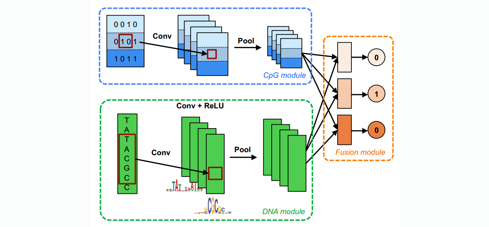

# Deep Learning Applications for Genomics

- `papers` floder consists of papers I read.
- `readings` folder consists of introductory papers or lecture notes for me to learn.

# Useful Resources:
- [Deep Learning in Genomics and Biomedicine, Stanford CS273B](https://canvas.stanford.edu/courses/51037)
- [A List of DL in Biology on Github]( https://github.com/hussius/deeplearning-biology)
- [A List of DL in Biology](https://followthedata.wordpress.com/2015/12/21/list-of-deep-learning-implementations-in-biology/)

# **Contents**

[08/16 DanQ: CNN 1 layer+BLSTM](#0816-danq-cnn-1-layerblstm)

[08/17 DeepCpG: combine 2 CNN sub-models](#0817-deepcpg-combine-2-cnn-sub-models)

[08/18 DeepNano: simply BLSTM](#0818-deepnano-simply-blstm)

[08/18 DeepSEA: noncoding variants with CNN sequence model](#0818-deepsea-noncoding-variants-with-cnn-sequnce-model)

[08/18 Basset: CNN learn functional activities of DNA sequences](#0818-basset-cnn-learn-functional-activities-of-dna-sequences)

[08/18 Deep Bayes: splicing code for genetic determinants of disease](#0818-deep-bayes-splicing-code-for-genetic-determinants-of-disease)

[08/22 Population Inference](#0822-population-inference)

# 08/16 DanQ: CNN 1 layer+BLSTM

Quang D, Xie X. [DanQ: a hybrid convolutional and recurrent deep neural network for quantifying the function of DNA sequences](https://www.ncbi.nlm.nih.gov/pmc/articles/PMC4914104/)[J]. Nucleic acids research, 2016, 44(11): e107-e107.

### Model Purpose

DanQ is a powerful method for predicting the function of DNA directly from sequence alone, making it a valuable asset for studying the function of **noncoding DNA**. It

- Modeling the properties and functions of DNA sequences is particularly difficult for non-coding DNA, the vast majority of which is still poorly understood in terms of function. 
- Over 98% of the human genome is non-coding and 93% of disease-associated variants lie in noncoding regions.
### Model Layers

1. **Input: on-hot (of ATCG)**

2. **1 Convolution Layer** 
  Purpose: to scan sequences for motif sites;

3. **1 Max Pooling Layer**

   Pro: It's simple, compared to `3 convolution+2 max pooling` in DeepSEA.

4. **BLSTM**

   Purpose:

   - Motifs can follow a regulatory grammar governed by physical constraints that dictate the in vivo spatial arrangements and frequencies of combinations of motifs, a feature associated with tissue-specific functional elements such as enhancers. (**sequential** )
   - BLSTMs captures long-term dependencies (effective for **sequential** data)
   - BLSTMs success in phoneme classification, speech recognition, machine translation and human action recognition

5. **1 Dense Layer of  ReLU  units**, similar to the DeepSEA

6. **Output: sigmoid**, similar to the DeepSEA

### Model Details

- Initialization: 
  - a) `weights ~ *uniform*(-0.05,0.05) `and `biase = 0` 
  - b) They also tried to y is to initialize kernels from known motifs
- Validation loss(cross-entropy, classification) is evaluated at the end of each training epoch to monitor convergence 
- Dropout is implemented
- Logistic regression Model is trained for benchmark purposes
- **Training Time**: for 320 convolution, 60 epochs, while each takes ~6h.

### Comments

- They use **Precision-Recall AUC**, because given the sparsity of positive binary targets (∼2%), the ROC AUC statistic is highly inflated by the class imbalance, while PR AUC is less prone to inflation by the class imbalance than ROC AUC. This is a fact overlooked in the original DeepSEA paper. 

- DanQ is often compared with DeepSEA, they share datasets, and there are comparison results in DanQ paper.

# 08/17 DeepCpG: combine 2 CNN sub-models
Angermueller, Christof, Heather J. Lee, Wolf Reik, and Oliver Stegle. [*DeepCpG: Accurate Prediction of Single-Cell DNA Methylation States Using Deep Learning.*](http://www.biorxiv.org/content/early/2016/05/27/055715) Genome Biology 18 (April 11, 2017): 67. doi:10.1186/s13059-017-1189-z.

### Introduction

**Purpose**: Predicting DNA methylation states from DNA sequence and *incomplete methylation* profiles in *single cells*.

**Background**: Current protocolsd for assaying DNA methylation in single cells are limited by incomplete CpG coverage. Therefore, finding methods to predict missing methylation states are critical to enable genome-wide analyses. 

**Strength**

- Existing approaches *do not account for cell-to-cell* variability, which is critical for studying epigenetic diversity, though are able to predict average DNA methylation profiles in cell populations.
- Existing approaches require *a priori defined features* and genome annotations, which are typically limited to a narrow set of cell types and conditions.
- A *modular architecture*: do not separate the extraction of DNA sequence features and model training

### Model Layers

**The idea of this paper is similar to DeepMixedModel , they take advantage of two sub-models and use a fusion module to combine the two,**  referred as `modular architecture` in the paper. Both the input and the purpose of two sub-models are different.

The model is comprised of a 

- `CpG module`: accounts for correlations between CpG sites within and across cells

  - Input: Sparse single-cell CpG profiles, where

    `1`: Methylated CpG sites are denoted by ones

    `0`: unmethylated CpG sites by zero

    `?`: CpG sites with missing methylation state by question marks

- `DNA module`(conv+pool): detects informative sequence patterns (predictive sequence motifs)

  - Identifies patters in the CpG neighbourhood across multiple cells, using cell-specific convolution and pooling operations (rows in b)

The two are combined by a
- `Fusion module`: integrates the evidence from the CpG and DNA module to predict
  - models interactions between higher-level features derived form the DNA and CpG 

### Model Details

- Regularization: Elastic Net + Dropout
- mini-batch with SDG
- Theano with Keras
- Training time: 31h = 15h(CpG)+12h(DNA)+4h(fusion)
### Multiple applications of their methods:
- Predict single-cell methylation states / impute missing methylation states
- Analyze the effect of DNA sequence features on DNA methylation and investigate effects of DNA mutations and neighbouring CpG sites on CpG methylation:
  - Discover methylation-associated motifs (conv+pooling)
  - Estimating the effect of single nucleotide mutations on CpG methylation
  - Quantify the effect of epimutations on neighbouring CpG sites, finding a clear relationship between distance and the mutational effect

- Discove DNA sequence motifs that are associated with epigenetic variability

### Comments

- As stated in the paper, the convolutional architecture allows for discovering predictive motifs in larger DNA sequence contexts, as well as for capturing complex methylation patterns in neighbouring CpG sites. (I think the idea is adopted from image processing by DL)
- Modular Architecture
- Contribution: Facilitate the assaying of larger number of cells by
  - enables analysis on low-coverage single-cell methylation data. The accurate imputation of missing methylation states facilitate genome-wide downstream analyses.
  - reduces required sequencing depth in single-cell bisulfite sequencing studies, thereby enabling assaying larger numbers of cells at lower cost. 

# 08/18 DeepNano: simply BLSTM

Boža V, Brejová B, Vinař T. DeepNano: [Deep recurrent neural networks for base calling in MinION nanopore reads](https://arxiv.org/abs/1603.09195)[J]. PloS one, 2017, 12(6): e0178751.

### Introduction
The [MinION device by Oxford Nanopore](https://nanoporetech.com/products/minion) is the first portable sequencing device. The papre presents the first open-source DNA base caller for MinION](http://compbio.fmph.uniba.sk/deepnano/). They employ carefully crafted RNNs to improves the base calling accuracy compared to the default base caller supplied by the manufacturer and hence reduce the sequencing error rate. 

### Model

##### Bidirectional-LSTM

- LSTM: potentially captures long-distance dependencies
  in the data, whereas HMMs(used by Metrichor, default base caller of MinION) use fixed k-mers.
- Bidirection: the prediction for input vector can be influenced by both data seen before and after it.

For 1D base calling: 3 hidden layers with 100 hidden units in each layer;

For 2D base calling: 3 hidden layers with 250 hidden units in each layer;

##### Challenge

The correspondence between the outputs and individual events is unknown. They only know the region of the reference sequence where the read is aligned . The problem is solved by simple heuristic and maximum likelihood. 

### Details
- Theano
- Optimization: SGD+Nesterov momentum; 
- Optimization: For 2D, they switch L-BFGS after several iterations
  - Their experience suggests that SGD is better at avoiding bad local optima in the initial phases of training, while L-BFGS seems to be faster during the final fine-tuning.
- They didn't adopt regularization methods, but the results suggest there is almost no overfitting.
### Comments
- They datasets for the reserch is not very large.
- They only use simple BLSTM. They think of future work on more elaborate network strucutres, but the training will then become time-consuming.
- The techniques they deal with alignment of outputs and individual events could be further  improved.

# 08/18 DeepSEA: noncoding variants with CNN sequnce model
Zhou, J., & Troyanskaya, O. G. (2015). [Predicting effects of noncoding variants with deep learning–based sequence model](https://www.ncbi.nlm.nih.gov/pmc/articles/PMC4768299/). Nature Methods, 12(10), 931–934. http://doi.org/10.1038/nmeth.3547
### Introduction
Noncoding genomic variations constitute the majority of disease and other trait-associated single-nucleotide polymorphisms (SNPs), but characterizing their functional effects remains a challenge.

The deep learning-based algorithmic framework [DeepSEA](http://deepsea.princeton.edu/job/analysis/create/) can predict the chromatin effects of sequence alterations with single nucleotide sensitivity. DeepSEA’s capability of utilizing flanking context sequences information enables context-specific sequence feature extraction, Sequence Profiler, which performs "in silico saturated mutagenesis" analysis for discovering informative sequence features within any sequence.

### Model
- DeepSEA uses classic CNN model, three convolution layers with 320, 480 and 960 kernels, respectively. The output is scaled by Sigmoid function.
- L-2 norm penalty of network weights matirx, L-1 norm penalty of output values.
- Dropout, momentum, SGD
- Torch 7.0
### Comments
Large amount of data and sufficent experiments on applications account for their success.

# 08/18 Basset: CNN-learn functional activities of DNA sequences
Kelley DR, Snoek J, Rinn JL. [Basset: learning the regulatory code of the accessible genome with deep convolutional neural networks](https://www.ncbi.nlm.nih.gov/pmc/articles/PMC4937568/). Genome Research. 2016;26(7):990-999. doi:10.1101/gr.200535.115.

### Introduction
The paper presents a open source package [Basset](https://github.com/davek44/Basset) which applys CNNs to learn functional activities of DNA sequences from genomics data.

It enables researchers to perform single sequencing assay in their cell type of interest and simultaneously learn that cell’s chromatin accessibility code and annotate every mutation in the genome with its influence on present accessibility and latent potential for accessibility. 

### Model
The basic structure is the same as DeepSEA, 3 layer CNNs(max pool+ReLU), with sigmoid nonlinearity maps performed on the output layer.
### Experiments and applications
- DNA sequence analysis: predicts the cell-specific functional activity  of sequences
  - Basset outperforms gkm-SVM on predicting the accessibility of a set of test sequences in 164 cell types.
- Recover unknown protein binding motifs
- *In silico saturation mutagenesis pinpoints nucleotides
  driving accessibility*: 
  - Saturation mutagenesis experiments, in which every mutation to a sequence is tested, are a powerful tool for dissecting the exact nucleotides driving a functional activity. 
  - use Basset to predicte accessibility for mutated sequences
- Enable genomic variant interpretation
  - *Basset predicts greater accessibility changes for likely causal GWAS SNPs*: Basset assigns greater SNP accessibility difference (SAD) scores to likely causal GWAS SNPs (PICS probability >0.5) versus unlikely nearby SNPs 
- Basset performs better if the model is trained on data from appropriate cell type instead of large-scale mapping projects
### Discussion

Predicting the functional output of DNA sequences is a fundamental problem in computational biology with a long history of approaches,  the shortcomings of the previously approaches are:

- most sequence kernel approaches immediately throw away position information to represent DNA as vectors of k-mer counts (Ghandi et al. 2014).

- Position-specific sequence kernels exist, but they greatly increase
  the dimensionality of the raw input space to which the sequence
  is initially mapped. 

In contrast, CNNs naturally consider positional relationships between sequence signals and is computational efficient.

# 08/18 Deep Bayes: splicing code for genetic determinants of disease
Xiong HY, Alipanahi B, Lee LJ, et al. [The human splicing code reveals new insights into the genetic determinants of disease](https://www.ncbi.nlm.nih.gov/pmc/articles/PMC4362528/). Science (New York, NY). 2015;347(6218):1254806. doi:10.1126/science.1254806.

In general, the method is able to accurately classify disease-causing variants and provides insights into the role of aberrant splicing in disease. **The model was trained to predict splicing from DNA sequence alone, without using disease annotations or population data. Consequently, its predictions are independent of and complementary to population data, GWAS, expression-based quantitative trait loci (QTL), and functional annotations of the genome.**

- Their results from profiling the genome-wide effects of more than 650,000 SNVs shed light on how genetic variation affects splicing.
- The model is not biased by existing disease annotations or population data and was derived in such a way that it can be used to study diverse diseases and disorders and to determine the consequences of common, rare, and even spontaneous variants. 
- In contrast to GWAS, this technique does not directly depend on allele frequencies. 
- This technique does not directly detect variants associated with a phenotype of interest but being combined with phenotype-matched genotype data such as those generated by whole-genome sequencing.

### Model: Deep Bayesian Learnig
- They assemble the human splicing regulatory model using Bayesian learning, each single model is a two-layer network with hidden units shared accross tissues(shared same set of hidden variables). By Bayes they mean *Kullback–Leibler divergence* of the target pattern for an exon and the prediction made by the regulatory model not trained on this exon, see page 9/83 in [Supplementory materials](http://science.sciencemag.org/content/sci/suppl/2014/12/17/science.1254806.DC1/Xiong.SM-corrected.pdf).
- Fitting a single model using a standard maximum likelihood learning method suffers severely from overfitting, so they adopted a *Bayesian Markov chain Monte Carlo (MCMC)* approach to search over billions of models with different structure and parameter values.

# 08/22: Population Inference

Sheehan, Sara, and Yun S. Song. [Deep learning for population genetic inference](http://journals.plos.org/ploscompbiol/article?id=10.1371/journal.pcbi.1004845). PLoS computational biology 12.3 (2016): e1004845.

### Introduction
Statistical inference for population genetics can be challenging since it is difficult to comput the likelihood of complex population genetic models both computationally and theoritically. Statistics alone can be infeasible and thus intractable when we want a further insight into the problem beyond predction. Therefore, this paper propose a novel *likelihood-free* inference framework to "estimate population genetic parameters and learn informative features of DNA sequence data".

"(page 2 of 28)Motivated by *Drosophila* data, where previous demographic estimates may have been confounded by pervasive selection, and the reverse also occurs as selection estimates being confounded by demography", the paper aims on a joint inference of demography and selection. 

Few previous works have addressed both population size changes and selection. And a wilded used  likelihood-free method, Approximate Bayesian Computation (ABC) suffers from the problem of "curse of dimensionality". Therefore, the paper focus on a challenging work of *jointly* predicting demography and selection, which are continuous parameters and categorical distributions, respectively.

### Model Details
The model structure is basic Deep Neural Networks(Multi-Layer Perception).

- Initialize the DNN(MLP) by auto-encoders. (stacked AEs)

**Note**: in Table 6 of their paper, they provide a **confusion matrix** to demonstrate the effectiveness of their pre-trainning.(it's new to me but I won't comment on the reasonableness of this metric)
- L-2 and KL divergent(discussed later) penalty

### Novelty
- **A KL divergence term is added in the cost function to ensure sparsity. This method is at least novel for me.** See page 19 of 28 in [this paper](http://journals.plos.org/ploscompbiol/article?id=10.1371/journal.pcbi.1004845). 

- Fisrt employ deep learning in population genomics
- First jointly inferring demography and selection
  motivated by Drosophila genome, which are continuous parameters and categorical distributions, respectively.

### Limitation
- Still partially rely on statistics, the model depends on PSMC for obtaining time change points. 
- manually extract input features from genes.(but it is reasonable, since this paper is a poineering work of applying DL in population genetics)
- In page 12 of 28, they perform a permutation tesing and a perturbation approach to determine the most informative statistics. But later methods like salient maps are suitable for discovering informtive features, though these methods are proposed after this paper(2015). 
