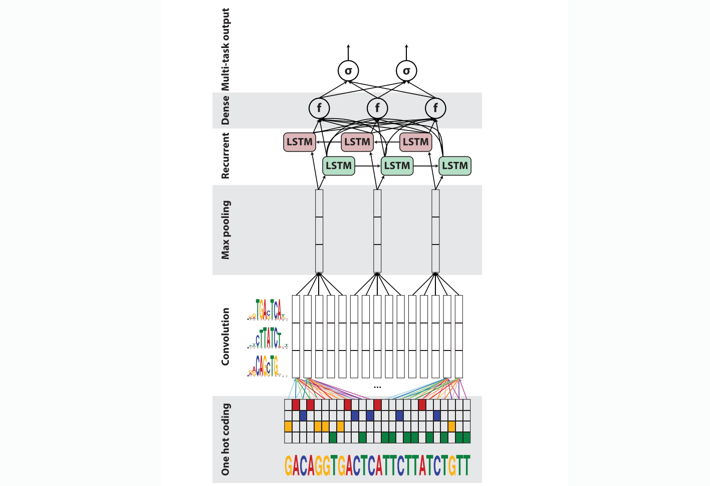

# Deep Learning Applications for Genomics

- `papers` floder consists of papers I read.
- `readings` folder consists of introductory papers or lecture notes for me to learn.

## Useful Resources:
- [Deep Learning in Genomics and Biomedicine, Stanford CS273B](https://canvas.stanford.edu/courses/51037)
- [A List of DL in Biology on Github]( https://github.com/hussius/deeplearning-biology)
- [A List of DL in Biology](https://followthedata.wordpress.com/2015/12/21/list-of-deep-learning-implementations-in-biology/)

## **Contents**

[08/17/2017](#08172017-danq-cnn-1-layerblstm) DanQ: CNN 1 layer+BLSTM

# 08/17/2017 DanQ: CNN 1 layer+BLSTM

Quang D, Xie X. [DanQ: a hybrid convolutional and recurrent deep neural network for quantifying the function of DNA sequences](https://www.ncbi.nlm.nih.gov/pmc/articles/PMC4914104/)[J]. Nucleic acids research, 2016, 44(11): e107-e107.

### Model Purpose

DanQ is a powerful method for predicting the function of DNA directly from sequence alone, making it a valuable asset for studying the function of **noncoding DNA**. It

- Modeling the properties and functions of DNA sequences is particularly difficult for non-coding DNA, the vast majority of which is still poorly understood in terms of function. 
- Over 98% of the human genome is non-coding and 93% of disease-associated variants lie in noncoding regions.
### Model Layers

1. **Input: on-hot (of ATCG)**

2. **1 Convolution Layer** 
  Purpose: to scan sequences for motif sites;

3. **1 Max Pooling Layer**

   Pro: It's simple, compared to `3 convolution+2 max pooling` in DeepSEA.

4. **BLSTM**

   Purpose:

   - Motifs can follow a regulatory grammar governed by physical constraints that dictate the in vivo spatial arrangements and frequencies of combinations of motifs, a feature associated with tissue-specific functional elements such as enhancers. (**sequential** )
   - BLSTMs captures long-term dependencies (effective for **sequential** data)
   - BLSTMs success in phoneme classification, speech recognition, machine translation and human action recognition

5. **1 Dense Layer of  ReLU  units**, similar to the DeepSEA

6. **Output: sigmoid**, similar to the DeepSEA

### Model Details

- Initialization: 
  - a) `weights ~ *uniform*(-0.05,0.05) `and `biase = 0` 
  - b) They also tried to y is to initialize kernels from known motifs
- Validation loss(cross-entropy, classification) is evaluated at the end of each training epoch to monitor convergence 
- Dropout is implemented
- Logistic regression Model is trained for benchmark purposes
- **Training Time**: for 320 convolution, 60 epochs, while each takes ~6h.

### Comments

- They use **Precision-Recall AUC**, because given the sparsity of positive binary targets (∼2%), the ROC AUC statistic is highly inflated by the class imbalance, while PR AUC is less prone to inflation by the class imbalance than ROC AUC. This is a fact overlooked in the original DeepSEA paper. 

- DanQ is often compared with DeepSEA, they share datasets, and there are comparison results in DanQ paper.
